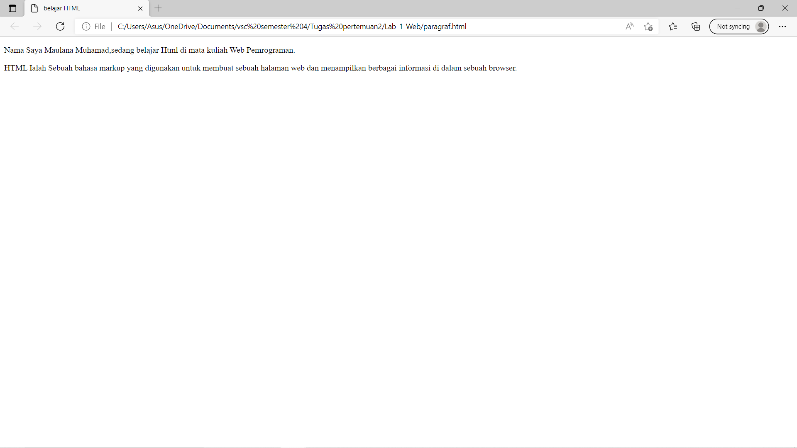
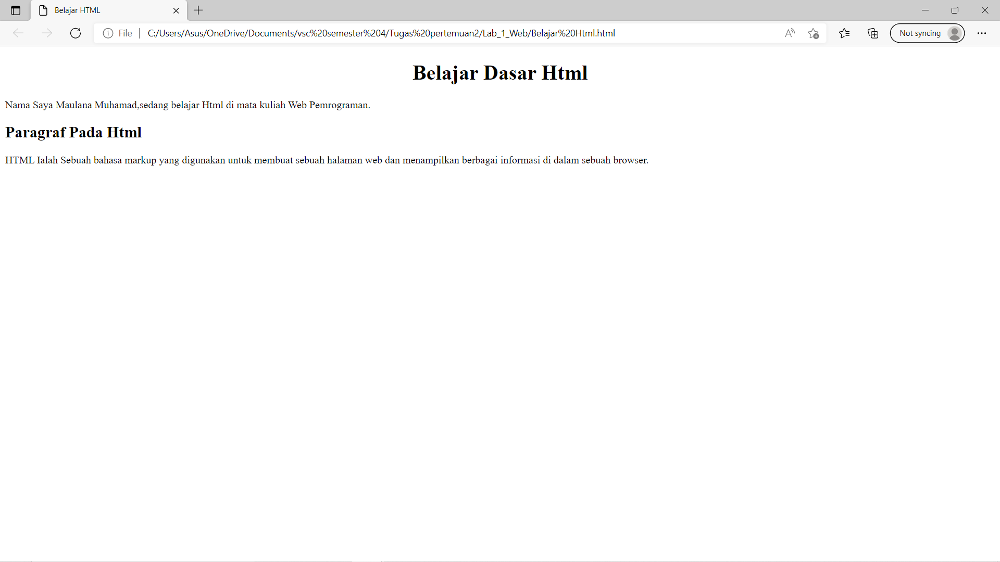
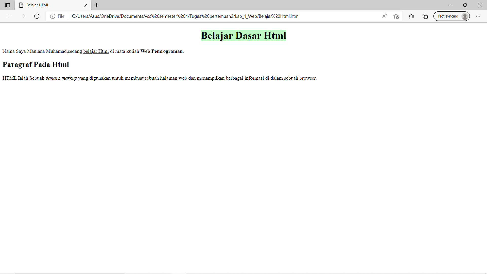

# Lab 1 Web
<hr>
Nama    : Maulana Muhamad <br>

NIM     : 312010188 <br>

Kelas   : TI.20. A.1 <br>
<hr>
 
 ## Paragraf
 
Ini adalah sebuah hasil dari texs Kodingan tag <p>

dibawah ini Adalah Codingan Dari Gambar Diatas:

```html
<!DOCTYPE html>
<html lang="en">
<head>
    <meta charset="UTF-8">    <meta http-equiv="X-UA-Compatible" content="IE=edge">
    <meta name="viewport" content="width=device-width, initial-scale=1.0">
    <title>Belajar HTML</title>
</head>
<body>
<!-- Paragraf Pertama -->
<p>Nama Saya Maulana Muhamad,sedang belajar Html di mata kuliah Web Pemrograman.</p>
<!-- Paragraf Kedua -->
<p>HTML Ialah Sebuah bahasa markup yang digunakan untuk membuat sebuah halaman web dan menampilkan berbagai informasi di  dalam sebuah browser.</p>
</body>
</html>
```

## Heading


Ini adalah Contoh heading ,Heading sendiri adalah sebagai judul dari sebuah artikel

dibawah ini Adalah Codingan Dari Gambar Diatas:

```html
<!DOCTYPE html>
<html lang="en">
<head>
    <meta charset="UTF-8">    <meta http-equiv="X-UA-Compatible" content="IE=edge">
    <meta name="viewport" content="width=device-width, initial-scale=1.0">
    <title>Belajar HTML</title>
</head>
<body>
<!-- Judul Paragraf Pertama -->
<h1 align="center">Belajar Dasar Html</h1>
<!-- Paragraf Pertama -->
<p>Nama Saya Maulana Muhamad,sedang belajar Html di mata kuliah Web Pemrograman.</p>
<!-- Judul Paragraf kedua -->
<h2>Paragraf Pada Html</h2>
<!-- Paragraf Kedua -->
<p>HTML Ialah Sebuah bahasa markup yang digunakan untuk membuat sebuah halaman web dan menampilkan berbagai informasi di  dalam sebuah browser.</p>
</body>
</html>
```

## Teks Format


Ini adalah Contoh dari Teks format seperti Menambahkan (Span) Untuk Warna Teks atau sebuah background

dibawah ini Adalah Codingan Dari Gambar Diatas:

```Html
<!DOCTYPE html>
<html lang="en">
<head>
    <meta charset="UTF-8">    <meta http-equiv="X-UA-Compatible" content="IE=edge">
    <meta name="viewport" content="width=device-width, initial-scale=1.0">
    <title>Belajar HTML</title>
</head>
<body>
<!-- Judul Paragraf Pertama -->
<h1 align="center"> <Span style="background-color: rgba(65, 241, 79, 0.336);"> Belajar Dasar Html </Span>  </h1>
<!-- Paragraf Pertama -->
<p>Nama Saya Maulana Muhamad,sedang <u>belajar Html</u> di mata kuliah <b>Web Pemrograman</b>.</p>
<!-- Judul Paragraf kedua -->
<h2>Paragraf Pada Html</h2>
<!-- Paragraf Kedua -->
<p>HTML Ialah Sebuah <i>bahasa markup</i> yang digunakan untuk membuat sebuah halaman web dan menampilkan berbagai informasi di  dalam sebuah browser.</p>
</body>
</html>
```