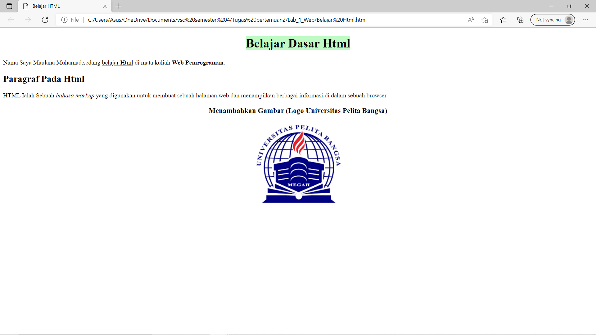

# Lab 1 Web
<hr>
Nama    : Maulana Muhamad <br>

NIM     : 312010188 <br>

Kelas   : TI.20. A.1 <br>
<hr>
 
 ## Paragraf
 
Gambar di atas adalah sebuah hasil dari texs Kodingan tag <p>

### Dibawah ini Adalah Codingan Dari Gambar Diatas:

```html
<!DOCTYPE html>
<html lang="en">
<head>
    <meta charset="UTF-8">    <meta http-equiv="X-UA-Compatible" content="IE=edge">
    <meta name="viewport" content="width=device-width, initial-scale=1.0">
    <title>Belajar HTML</title>
</head>
<body>
<!-- Paragraf Pertama -->
<p>Nama Saya Maulana Muhamad,sedang belajar Html di mata kuliah Web Pemrograman.</p>
<!-- Paragraf Kedua -->
<p>HTML Ialah Sebuah bahasa markup yang digunakan untuk membuat sebuah halaman web dan menampilkan berbagai informasi di  dalam sebuah browser.</p>
</body>
</html>
```

## Heading


Gambar di atas adalah Contoh heading ,Heading sendiri adalah sebagai judul dari sebuah artikel

### Dibawah ini Adalah Codingan Dari Gambar Diatas:

```html
<!DOCTYPE html>
<html lang="en">
<head>
    <meta charset="UTF-8">    <meta http-equiv="X-UA-Compatible" content="IE=edge">
    <meta name="viewport" content="width=device-width, initial-scale=1.0">
    <title>Belajar HTML</title>
</head>
<body>
<!-- Judul Paragraf Pertama -->
<h1 align="center">Belajar Dasar Html</h1>
<!-- Paragraf Pertama -->
<p>Nama Saya Maulana Muhamad,sedang belajar Html di mata kuliah Web Pemrograman.</p>
<!-- Judul Paragraf kedua -->
<h2>Paragraf Pada Html</h2>
<!-- Paragraf Kedua -->
<p>HTML Ialah Sebuah bahasa markup yang digunakan untuk membuat sebuah halaman web dan menampilkan berbagai informasi di  dalam sebuah browser.</p>
</body>
</html>
```

## Teks Format


Gambar di atas adalah Contoh dari Teks format seperti Menambahkan (Span) Untuk Warna Teks atau sebuah background

### Dibawah ini Adalah Codingan Dari Gambar Diatas:

```Html
<!DOCTYPE html>
<html lang="en">
<head>
    <meta charset="UTF-8">    <meta http-equiv="X-UA-Compatible" content="IE=edge">
    <meta name="viewport" content="width=device-width, initial-scale=1.0">
    <title>Belajar HTML</title>
</head>
<body>
<!-- Judul Paragraf Pertama -->
<h1 align="center"> <Span style="background-color: rgba(65, 241, 79, 0.336);"> Belajar Dasar Html </Span>  </h1>
<!-- Paragraf Pertama -->
<p>Nama Saya Maulana Muhamad,sedang <u>belajar Html</u> di mata kuliah <b>Web Pemrograman</b>.</p>
<!-- Judul Paragraf kedua -->
<h2>Paragraf Pada Html</h2>
<!-- Paragraf Kedua -->
<p>HTML Ialah Sebuah <i>bahasa markup</i> yang digunakan untuk membuat sebuah halaman web dan menampilkan berbagai informasi di  dalam sebuah browser.</p>
</body>
</html>
```
## Menambahkan Logo UPB


Gambar di atas adalah tag Bagaimana Menambahkan foto/Gambar Ke dalam html yaitu dengan menggunakan tag (img) Kemuduian simpan Pada Folder Yang telah dibuat

### Dibawah ini Adalah Codingan Dari Gambar Diatas:

```html
<!DOCTYPE html>
<html lang="en">
<head>
    <meta charset="UTF-8">    <meta http-equiv="X-UA-Compatible" content="IE=edge">
    <meta name="viewport" content="width=device-width, initial-scale=1.0">
    <title>Belajar HTML</title>
</head>
<body>
<!-- Judul Paragraf Pertama -->
<h1 align="center"> <Span style="background-color: rgba(65, 241, 79, 0.336);"> Belajar Dasar Html </Span>  </h1>
<!-- Paragraf Pertama -->
<p>Nama Saya Maulana Muhamad,sedang <u>belajar Html</u> di mata kuliah <b>Web Pemrograman</b>.</p>
<!-- Judul Paragraf kedua -->
<h2>Paragraf Pada Html</h2>
<!-- Paragraf Kedua -->
<p>HTML Ialah Sebuah <i>bahasa markup</i> yang digunakan untuk membuat sebuah halaman web dan menampilkan berbagai informasi di  dalam sebuah browser.</p>
<!-- Sub Judul Paragraf -->
<h3 align="center">Menambahkan Gambar (Logo Universitas Pelita Bangsa)</h3>   
<!-- Menambahkan gambar pada Paragraf -->
<h1 align="center">  </h1>
</body>
</html>
```

## Menambahkan Link


Untuk menambahkan Link menggunakan (img) dan simpan dalam folder yang sesuai

### Dibawah ini Adalah Codingan Dari Gambar Diatas:
```html
<!DOCTYPE html>
<html lang="en">
<head>
    <meta charset="UTF-8">    <meta http-equiv="X-UA-Compatible" content="IE=edge">
    <meta name="viewport" content="width=device-width, initial-scale=1.0">
    <title>Belajar HTML</title>
</head>
<body>
<!-- Menambahkkan link Navigasi  -->
<nav>
    <a href="Belajar Html.html">html </a>
    <a href="https://github.com/maulana-023/Lab_1_Web.git">halaman web ekternal</a>
    <hr>
    </nav>
<!-- Judul Paragraf Pertama -->
<h1 align="center"> <Span style="background-color: rgba(65, 241, 79, 0.336);"> Belajar Dasar Html </Span>  </h1>
<!-- Paragraf Pertama -->
<p>Nama Saya Maulana Muhamad,sedang <u>belajar Html</u> di mata kuliah <b>Web Pemrograman</b>.</p>
<!-- Judul Paragraf kedua -->
<h2>Paragraf Pada Html</h2>
<!-- Paragraf Kedua -->
<p>HTML Ialah Sebuah <i>bahasa markup</i> yang digunakan untuk membuat sebuah halaman web dan menampilkan berbagai informasi di  dalam sebuah browser.</p>
<!-- Sub Judul Paragraf -->
<h3 align="center">Menambahkan Gambar (Logo Universitas Pelita Bangsa)</h3>   
<!-- Menambahkan gambar pada Paragraf -->
<h1 align="center">  </h1>
</body>
</html>
```